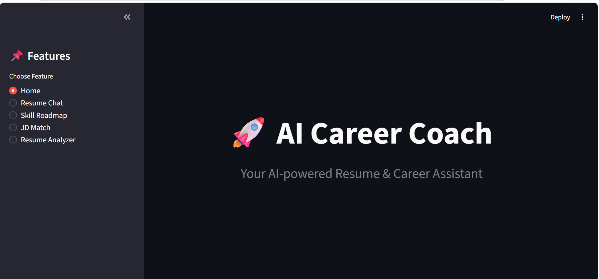
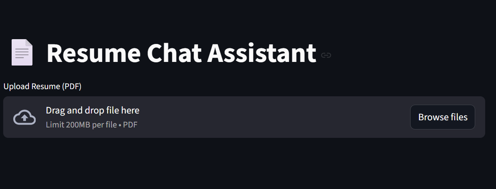
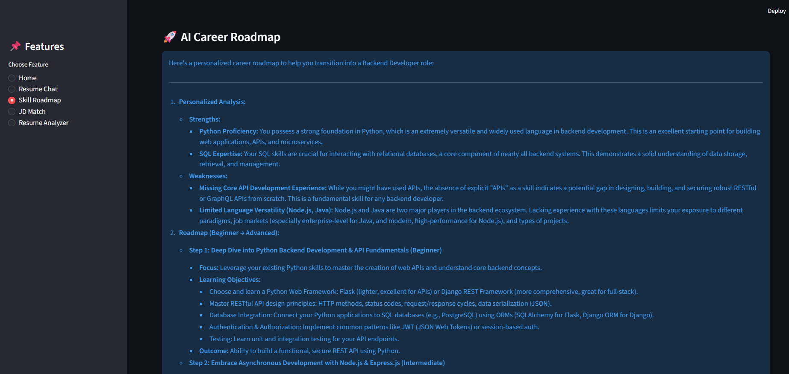
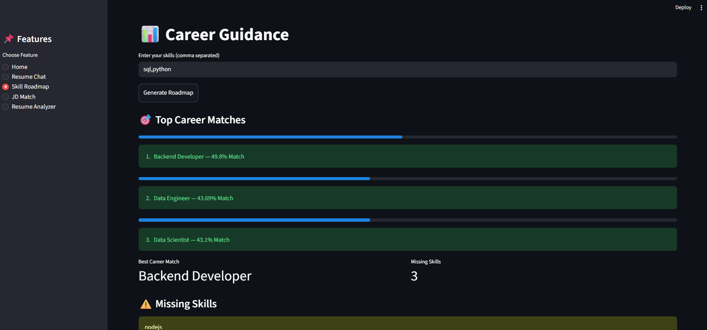
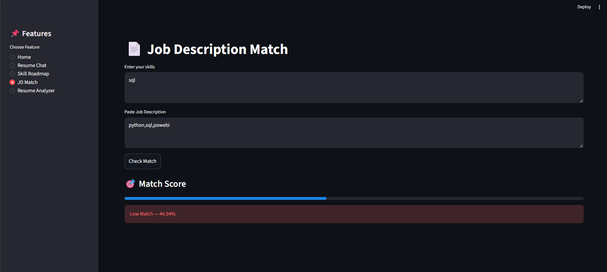
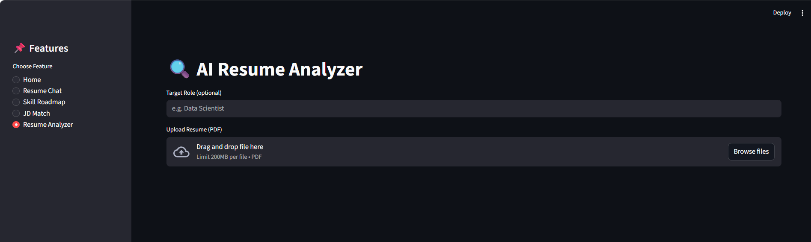

# 🚀 AI Powered Career Coach

AI Powered Career Coach is a full-stack AI-based career assistance platform that leverages NLP and Generative AI to deliver intelligent resume analysis, job matching, career recommendations, and personalized learning roadmaps.

---

## 🏠 Home Page



---

# ✨ Features

## 📄 Resume Chat Assistant

Upload your resume and ask AI questions related to:
- strengths
- weaknesses
- resume improvements
- career suggestions
- technical guidance



---

## 📊 Skill Roadmap Generator

Enter your technical skills and the system will:
- recommend best career paths
- calculate career match percentage
- detect missing skills
- generate AI-powered learning roadmap
- suggest projects and technologies

### 🚀 Roadmap Output



<br>



---

## 📄 Job Description Match Checker

Compare your skills with a Job Description.

### Features
- calculates similarity percentage
- uses NLP similarity matching
- helps improve resume-job compatibility



---

## 🔍 AI Resume Analyzer

Advanced ATS-based resume analysis system.

### Features
- ATS score generation
- skills extraction
- missing skills detection
- experience estimation
- strength & weakness analysis
- resume improvement suggestions
- full AI-powered analysis



---

# 🛠️ Technologies Used

| Technology | Purpose |
|---|---|
| Python | Backend Development |
| Streamlit | Frontend UI |
| Pandas | Data Handling |
| Scikit-learn | NLP & Similarity Matching |
| TF-IDF Vectorizer | Text Vectorization |
| Cosine Similarity | Skill Matching |
| Gemini AI API | AI Response Generation |
| pdfplumber | Resume PDF Text Extraction |

---

# 📂 Project Structure

```text
AI_Career_Coach/
│
├── app.py
├── llm.py
├── career.py
├── resume.py
├── resume_analyzer.py
├── jd_matcher.py
├── careers.csv
├── requirements.txt
├── .env
├── README.md
└── images/
```

---

# ⚙️ Installation

## 1️⃣ Clone Repository

```bash
git clone https://github.com/yourusername/AI-Career-Coach.git
```

## 2️⃣ Move Into Project Folder

```bash
cd AI-Career-Coach
```

## 3️⃣ Install Dependencies

```bash
pip install -r requirements.txt
```

---

# 🔑 Setup Gemini API Key

Create a `.env` file:

```text
GEMINI_API_KEY=your_api_key_here
```

---

# ▶️ Run Project

```bash
streamlit run app.py
```

---

# 🌐 Deployment

This project is deployed using Streamlit Community Cloud.

🔗 Live App: https://ai-powered-career-coach-8t4cjtuypuaicy3mojoqrc.streamlit.app/

You can access the AI Career Coach directly from the browser without installation.

### Recommended:
- Streamlit Community Cloud

---

# 📸 Application Workflow

1. User selects feature
2. User uploads resume or enters skills
3. NLP models process text
4. Gemini AI generates intelligent response
5. Streamlit displays results interactively

---

# 🎯 Advantages

- Beginner-friendly UI
- AI-powered guidance
- Personalized recommendations
- ATS resume analysis
- Real-time skill matching
- Interactive dashboard

---

# ⚠️ Limitations

- Depends on internet connection
- Gemini API quota limitations
- AI responses may vary
- Accuracy depends on resume quality

---

# 🚀 Future Enhancements

- Authentication system
- Resume vs JD direct comparison
- Database integration
- AI interview preparation
- Cloud database support
- Multi-language support
- Resume template generator

---

# 👩‍💻 Developer

Developed by Somya Nema

B.Tech AI & ML Student

---

# ⭐ Conclusion

AI Powered Career Coach is an intelligent career assistance platform that combines NLP, Machine Learning, and Generative AI to help students and professionals improve their resumes, discover career opportunities, and build personalized learning roadmaps.
